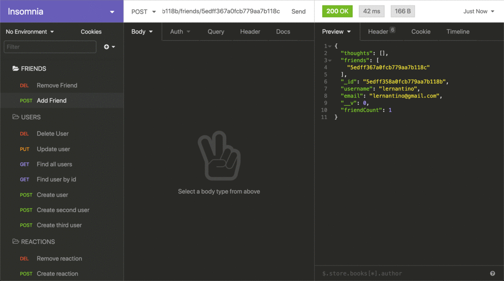

# Social Network API

## Description
 This is an API for a social network web application where users can share their thoughts, react to friends’ thoughts, and create a friend list. 
 
 ## Technology
 - Express.js for routing
 - MongoDB database
 - Mongoose ODM
 - JavaScript date library of choice or native JavaScript Date object to format timestamps

 ## GitHub URL
 https://github.com/MissyStiner/social-network-api

 ## Walkthrough Video Demo URL
 https://watch.screencastify.com/v/XhG29vvefOKmh9RAFUtp

 ## User Story
 AS A social media startup 
I WANT an API for my social network that uses a NoSQL database 
SO THAT my website can handle large amounts of unstructured data

## Acceptance Criteria
GIVEN a social network API 
WHEN I enter the command to invoke the application 
THEN my server is started and the Mongoose models are synced to the MongoDB database 
WHEN I open API GET routes in Insomnia Core for users and thoughts 
THEN the data for each of these routes is displayed in a formatted JSON 
WHEN I test API POST, PUT, and DELETE routes in Insomnia Core 
THEN I am able to successfully create, update, and delete users and thoughts in my database 
WHEN I test API POST and DELETE routes in Insomnia Core 
THEN I am able to successfully create and delete reactions to thoughts and add and remove friends to a user’s friend list

## Mock-Up
The following animation shows GET routes to return all users and all thoughts being tested in Insomnia Core:

The following animation shows GET routes to return a single user and a single thought being tested in Insomnia Core:

The following animation shows the POST, PUT, and DELETE routes for users being tested in Insomnia Core:

The following animation shows the POST and DELETE routes for a user’s friend list being tested in Insomnia Core:

## Models

### User
#### username
- String
- Unique
- Required
- Trimmed
#### email
- String
- Required
- Unique
- Must match a valid email address (look into Mongoose's matching validation)
#### thoughts
- Array of _id values referencing the Thought model
#### friends
- Array of _id values referencing the User model (self-reference)

### Schema Settings
- Create a virtual called friendCount that retrieves the length of the user's friends array field on query.

### Thought
#### thoughtText
- String
- Required
- Must be between 1 and 280 characters
#### createdAt
- Date
- Set default value to the current timestamp
- Use a getter method to format the timestamp on query
#### username (The user that created this thought)
- String
- Required
#### reactions (These are like replies)
- Array of nested documents created with the reactionSchema

### Schema Settings
- Create a virtual called reactionCount that retrieves the length of the thought's reactions array field on query.

### Reaction (SCHEMA ONLY)
#### reactionId
- Use Mongoose's ObjectId data type
- Default value is set to a new ObjectId
#### reactionBody
- String
- Required
- 280 character maximum
#### username
- String
- Required
#### createdAt
- Date
- Set default value to the current timestamp
- Use a getter method to format the timestamp on query

### Schema Settings
- This will not be a model, but rather will be used as the reaction field's subdocument schema in the Thought model.

## API Routes
### /api/users
#### - GET all users
#### - GET a single user by its _id and populated thought and friend data
#### - POST a new user:
// example data 
{ 
  "username": "lernantino", 
  "email": "lernantino@gmail.com" 
}
#### - PUT to update a user by its _id

#### - DELETE to remove user by its _id

- BONUS: Remove a user's associated thoughts when deleted.

### /api/users/:userId/friends/:friendId

#### - POST to add a new friend to a user's friend list

#### - DELETE to remove a friend from a user's friend list

### /api/thoughts

#### - GET to get all thoughts

#### - GET to get a single thought by its _id

#### - POST to create a new thought (don't forget to push the created thought's _id to the associated user's thoughts array field)
// example data 
{ 
  "thoughtText": "Here's a cool thought...", 
  "username": "lernantino", 
  "userId": "5edff358a0fcb779aa7b118b" 
}
#### - PUT to update a thought by its _id

#### - DELETE to remove a thought by its _id

### /api/thoughts/:thoughtId/reactions

#### - POST to create a reaction stored in a single thought's reactions array field

#### - DELETE to pull and remove a reaction by the reaction's reactionId value